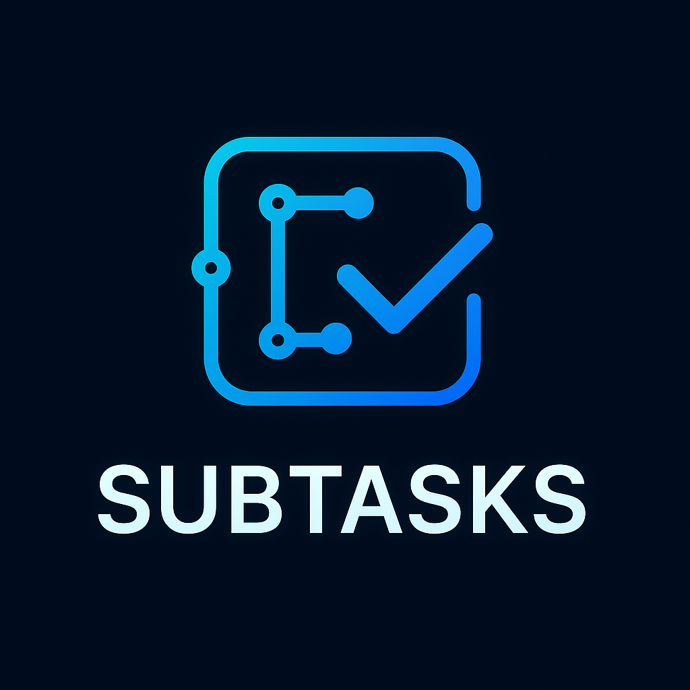

# FocusFlow - AI智慧學習計劃暨專注助手



FocusFlow 是一款基於 AI 的智慧學習計劃與專注管理應用程式，採用 React Native (Expo) + Node.js 架構，整合 Google Gemini AI 協助使用者制定個人化學習計劃、管理任務進度，並提供專注計時功能。

## 🌟 主要功能

### 🧠 AI 智慧學習規劃
- **個人化學習計劃生成**：透過 AI 分析使用者需求，自動生成結構化學習路徑
- **動態子任務分解**：將複雜學習目標分解為可執行的具體子任務
- **多階段學習方法論**：基於認知科學的 6 階段學習法（知識、實踐、應用、反思、輸出、複習）
- **智慧時間估算**：AI 自動評估任務完成時間，支援手動調整

### 📅 智能排程系統
- **自動時間安排**：根據使用者可用時間自動排程學習任務
- **可行性分析**：智慧分析排程衝突並提供調整建議
- **彈性重排**：支援任務延期、提前完成等動態調整
- **進度追蹤**：即時監控學習進度，提供完成度統計

### ⏰ 專注計時器
- **番茄工作法**：內建番茄鐘功能，25分鐘專注 + 5分鐘休息
- **自訂計時模式**：支援自定義專注時長
- **休息提醒**：智慧休息建議，避免過度疲勞
- **統計分析**：專注時間統計與趨勢分析

### 📊 學習統計與分析
- **進度追蹤**：視覺化展示學習進度
- **時間統計**：每日、每週、每月專注時間統計
- **完成率分析**：任務完成情況分析
- **學習效率評估**：基於時間投入與產出的效率分析

### 🔄 間隔重複學習
- **科學復習排程**：基於 Ebbinghaus 遺忘曲線的復習提醒
- **知識點鞏固**：定期復習已學內容，確保長期記憶
- **自適應間隔**：根據掌握程度調整復習頻率

## 🏗️ 技術架構

### 前端 (React Native + Expo)
- **React Native 0.79.5** + **Expo SDK 53**
- **TypeScript** 支援完整類型檢查
- **Zustand** 輕量化狀態管理
- **NativeWind** CSS-in-JS 樣式方案
- **React Navigation** 導航路由
- **i18next** 國際化支援（繁體中文、英文）

### 後端 (Node.js + Express)
- **Node.js** + **Express 5.1.0**
- **Google Gemini 2.5 Flash** AI 模型整合
- **結構化 JSON Schema** 確保 AI 回應品質
- **快取機制** 提升回應速度
- **成本監控** API 使用量統計

### 資料儲存
- **AsyncStorage** 本地資料持久化
- **JSON** 格式任務與設定儲存
- **增量同步** 資料更新機制

### 測試與品質保證
- **Playwright** 端對端自動化測試
- **TypeScript** 嚴格模式類型檢查
- **ESLint** 程式碼品質檢查
- **統一日誌系統** 開發與產品環境日誌管理

## 🚀 快速開始

### 環境需求
- **Node.js** 18+ 
- **npm** 或 **yarn**
- **Expo CLI**
- **Android Studio** (Android 開發)
- **Xcode** (iOS 開發，僅限 macOS)

### 安裝與啟動

1. **複製專案**
```bash
git clone https://github.com/your-username/FocusFlow.git
cd FocusFlow
```

2. **安裝依賴**
```bash
npm install
cd focusflow-backend && npm install && cd ..
```

3. **環境配置**
```bash
# 複製環境變數檔案
cp focusflow-backend/.env.example focusflow-backend/.env

# 編輯 .env 檔案，設定 Gemini API Key
nano focusflow-backend/.env
```

4. **啟動開發環境**
```bash
# 同時啟動前端和後端
npm run dev

# 或分別啟動
npm run backend    # 後端服務 (port 3001)
npm start         # 前端應用
```

5. **行動裝置測試**
```bash
# Android
npm run android

# iOS (僅限 macOS)
npm run ios

# Web 版本
npm run web
```

### Gemini API 設定

1. 取得 Google Gemini API Key：[Google AI Studio](https://makersuite.google.com/app/apikey)
2. 在 `focusflow-backend/.env` 中設定：
```env
GEMINI_API_KEY=your_gemini_api_key_here
DEFAULT_MODEL=gemini-2.5-flash
LOG_LEVEL=DEBUG
```

## 📱 主要頁面與功能

### 🏠 首頁 (app/(tabs)/index.tsx)
- 今日專注時間統計
- 今日排程任務列表
- 即將到期任務提醒
- 快速開始專注按鈕

### ➕ 新增任務 (app/add-task.tsx)
- AI 智慧任務分析
- 個人化問題收集
- 動態子任務生成
- 自動時間安排

### 📋 任務列表 (app/(tabs)/tasks.tsx)
- 全部任務檢視
- 篩選與排序功能
- 進度追蹤
- 批次操作

### ⏰ 專注模式 (app/focus.tsx)
- 番茄計時器
- 背景噪音（可選）
- 進度記錄
- 中斷處理

### 📊 統計分析 (app/(tabs)/stats.tsx)
- 學習時間趨勢
- 任務完成統計
- 效率分析圖表
- 週期性報告

## 🤖 AI 功能架構

### 提示詞管理 (focusflow-backend/lib/prompts/)
- **main_prompt.js**: 主要學習計劃生成提示詞
- **personalization_prompt.js**: 個人化問題生成提示詞

### AI 服務層 (focusflow-backend/lib/services/)
- **geminiService.js**: Gemini API 整合與結構化回應處理
- **cacheService.js**: 智慧快取機制
- **costMonitoringService.js**: API 使用量與成本監控
- **batchProcessingService.js**: 批次處理最佳化

### API 端點 (focusflow-backend/routes/)
- `POST /ai/personalization-direct` - 個人化問題生成
- `POST /ai/subtasks-direct` - 子任務生成
- `POST /ai/learning-plan-direct` - 完整學習計劃生成
- `GET /ai/health-check` - 系統健康檢查

## 🧪 測試

### 執行測試
```bash
# 端對端測試
npm run test:e2e

# 健康檢查測試
npm run test:e2e:headed

# 測試 UI
npm run test:e2e:ui
```

### 測試覆蓋範圍
- **導航測試** (tests/navigation.spec.ts)
- **任務建立流程** (tests/task-creation.spec.ts)
- **AI 功能整合** (tests/ai-functionality.spec.ts)
- **基本功能驗證** (tests/basic-functionality.spec.ts)
- **系統健康檢查** (tests/quick-health-check.spec.ts)

## 📁 專案結構

```
FocusFlow/
├── app/                          # 前端頁面 (Expo Router)
│   ├── (tabs)/                   # 標籤頁面
│   │   ├── index.tsx            # 首頁
│   │   ├── tasks.tsx            # 任務列表
│   │   ├── stats.tsx            # 統計分析
│   │   └── profile.tsx          # 個人設定
│   ├── add-task.tsx             # 新增任務
│   ├── focus.tsx                # 專注模式
│   └── task-detail.tsx          # 任務詳情
├── components/                   # 可重用組件
│   ├── task-creation/           # 任務建立專用組件
│   ├── Button.tsx               # 通用按鈕
│   ├── TaskItem.tsx             # 任務項目
│   └── FocusTimer.tsx           # 專注計時器
├── store/                       # Zustand 狀態管理
│   ├── taskStore.ts             # 任務狀態
│   ├── timerStore.ts            # 計時器狀態
│   └── settingsStore.ts         # 設定狀態
├── utils/                       # 工具函數
│   ├── api.ts                   # API 呼叫
│   ├── scheduling.ts            # 排程邏輯
│   └── timeUtils.ts             # 時間處理
├── types/                       # TypeScript 類型定義
│   ├── task.ts                  # 任務相關類型
│   └── timeSlot.ts              # 時間槽類型
├── focusflow-backend/           # 後端服務
│   ├── routes/                  # API 路由
│   ├── lib/services/            # 核心服務
│   ├── lib/prompts/             # AI 提示詞
│   └── config/                  # 配置檔案
├── tests/                       # 測試檔案
└── docs/                        # 專案文檔
```

## 🔧 開發設定

### 程式碼規範
- **TypeScript 嚴格模式**：確保類型安全
- **ESLint 配置**：統一程式碼風格
- **統一日誌系統**：開發與生產環境日誌管理
- **錯誤處理**：完整的錯誤捕獲與回復機制

### 環境變數
```env
# 後端配置 (focusflow-backend/.env)
GEMINI_API_KEY=your_gemini_api_key_here
DEFAULT_MODEL=gemini-2.5-flash
DEFAULT_MAX_TOKENS=4000
DEFAULT_TEMPERATURE=0.3
REQUEST_TIMEOUT=30000
LOG_LEVEL=DEBUG
NODE_ENV=development
```

## 🤝 貢獻指南

1. **Fork** 專案
2. 建立功能分支 (`git checkout -b feature/amazing-feature`)
3. 提交變更 (`git commit -m 'Add amazing feature'`)
4. 推送到分支 (`git push origin feature/amazing-feature`)
5. 開啟 **Pull Request**

### 開發規範
- 遵循 TypeScript 嚴格模式
- 所有新功能需包含測試
- 提交訊息使用英文，格式：`type: description`
- 程式碼需通過 ESLint 檢查

## 📄 授權

此專案採用 MIT 授權條款

---

**讓學習更智慧，讓專注更有效 - FocusFlow 陪伴您的每一步成長之路** 🌱
